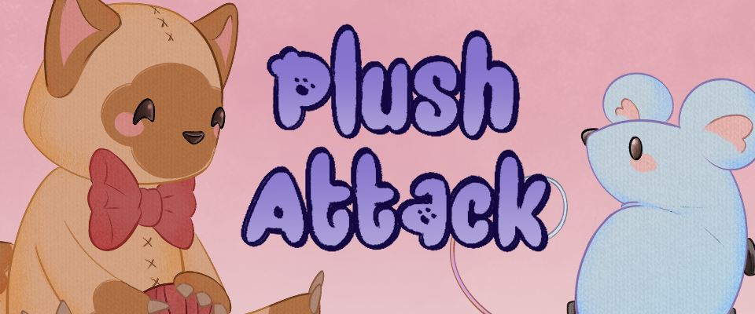

# Plush Attack

 Plush Attack is a 2D Platformer in a 3D Environment made for preschool kids. Chasing mice through multiple levels while paying attention to the time, leads to a perfect and fun learn effect.

 Made with Godot 4.2 and working with [Mercurial](https://www.mercurial-scm.org/) for version control.
 
 The Game was made as a 10 week Semester project during my first Semester at the S4G School for Games. It was my first experience making a game in a semi professional environment.

# Responsibilities
- Gameplay Programmer
- Version control

# Highlights
- [Player](https://github.com/JasperM04/PlushAttackTest/blob/main/scripts/player.gd) 2D Movement in a 3D Environment. Coyote-Time, Jumpbuffer and Jumpstrength.
   
- [Mouse](https://github.com/JasperM04/PlushAttackTest/blob/main/scripts/mouse.gd) Escaping the Player using the Holesystem.
